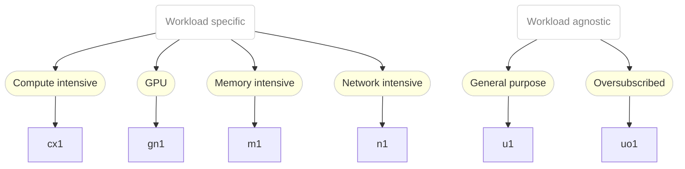

# Introduction

This is the documentation for the instance types defined in [instanceTypes.yaml](instanceTypes.yaml).

> **Note**
> The follow instance types are provided by OpenShift by default.
> They can be easily build and installed from source with:
>
> ```bash session
> $ kubectl kustomize > instanceTypes.yaml
> $ kubectl apply -f instanceTypes.yaml
> ```

# Overview

## Structure

The available instance types are structured into two themes:

1. Workload agnostic - or general purpose
2. Workload specific

Instance Types of the first theme are a good starting point to run your workload.
Once you know more about the requirements of your workload, you can start choosing a
specific instance type of the second class.

The following diagram summarises the available instance types and their use-cases:



### Schema

<details><summary>Click in order to view the instanceType names schema</summary>

```ebnf
instanceTypeName = seriesName , "." , size;

seriesName = ( class | vendorClass ) , version;

class = "u" | "uo" | "cx" | "m" | "n";
vendorClass = "g" , vendorHint;
vendorHint = "n" | "i" | "a";
version = "1";

size = "small" | "medium" | "large" | [( "2" | "4" | "8" )] , "xlarge";
```
</details>


# Series

.                           |  CX  |  GN  |  M  |  N  |  U  |  UO
----------------------------|------|------|-----|-----|-----|-----
*Has GPUs*                  |      |  ✓   |     |     |     |
*Hugepages*                 |      |      |  ✓  |  ✓  |     |
*Compressed RAM*            |      |      |     |     |     |  ✓
*Overcommitted Memory*      |      |      |     |     |     |  ✓
*Dedicated CPU*             |  ✓   |      |     |     |     |
*Burstable CPU performance* |      |  ✓   |  ✓  |  ✓  |  ✓  |  ✓
*Isolated emulator threads* |  ✓   |      |     |     |     |
*vNUMA*                     |  ✓   |      |     |     |     |
*vCPU-To-Memory Ratio*      | 1:4  | 1:4  | 1:8 | 1:4 | 1:2 | 1:2

## CX Series

The CX Series provides exclusive compute resources for compute
intensive applications.

*CX* is the abbreviation of "Compute Exclusive".

The exclusive resources are given to the compute threads of the
VM. In order to ensure this, some additional cores (depending
on the number of disks and NICs) will be requestedto offload
the IO threading from cores dedicated to the workload.
In addition, in this series, the NUMA topology of the used
cores is provided to the VM.

### CX Series Characteristics

Specific characteristics of this series are:
- *Dedicated CPU* - Physical cores are exclusively assigned to every
  vCPU in order to provide fixed and high compute guarantees to the
  workload
- *Isolated emulator threads* - Hypervisor emulator threads are isolated
  from the vCPUs in order to reduce emaulation related impact on the
  workload
- *vCPU-To-Memory Ratio (1:4)* - A vCPU-to-Memory ratio of 1:4, for less
  noise per node
- *vNUMA* - Physical NUMA topology is reflected in the guest in order to
  optimize guest sided cache utilization

### CX Series Instance Types

The following instance types are available in this series:

Name        | Cores | Memory
------------|-------|-------
cx1.medium  | 1     | 4Gi
cx1.large   | 2     | 8Gi
cx1.2xlarge | 8     | 32Gi
cx1.4xlarge | 16    | 64Gi
cx1.8xlarge | 32    | 128Gi


## GN Series

The GN Series provides instances types intended for VMs with
NVIDIA GPU resources attached.

*GN* is the abbreviation of "GPU NVIDIA".

This series is intended to be used with VMs consuming GPUs
provided by the [NVIDIA GPU Operator](https://github.com/NVIDIA/gpu-operator)
which is made available on OpenShift via OperatorHub.

### GN Series Characteristics

Specific characteristics of this series are:
- *Burstable CPU performance* - The workload has a baseline compute
  performance but is permitted to burst beyond this baseline, if
  excess compute is available
- *Has GPUs* - Has GPUs predefined
- *vCPU-To-Memory Ratio (1:4)* - A vCPU-to-Memory ratio of 1:4, for less
  noise per node

### GN Series Instance Types

The following instance types are available in this series:

Name        | Cores | Memory
------------|-------|-------
gn1.xlarge  | 4     | 16Gi
gn1.2xlarge | 8     | 32Gi
gn1.4xlarge | 16    | 64Gi
gn1.8xlarge | 32    | 128Gi


## M Series

The M Series provides resources for memory intensive
applications.

*M* is the abbreviation of "Memory".

### M Series Characteristics

Specific characteristics of this series are:
- *Burstable CPU performance* - The workload has a baseline compute
  performance but is permitted to burst beyond this baseline, if
  excess compute is available
- *Hugepages* - Hugepages are used in order to improve memory
  performance
- *vCPU-To-Memory Ratio (1:8)* - A vCPU-to-Memory ratio of 1:8, for much
  less noise per node

### M Series Instance Types

The following instance types are available in this series:

Name       | Cores | Memory
-----------|-------|-------
m1.large   | 2     | 16Gi
m1.xlarge  | 4     | 32Gi
m1.2xlarge | 8     | 64Gi
m1.4xlarge | 16    | 128Gi
m1.8xlarge | 32    | 256Gi


## N Series

The N Series provides resources for network intensive
applications, like VNFs.

*N* is the abbreviation of "Network".

### N Series Characteristics

Specific characteristics of this series are:
- *Burstable CPU performance* - The workload has a baseline compute
  performance but is permitted to burst beyond this baseline, if
  excess compute is available
- *Hugepages* - Hugepages are used in order to improve memory
  performance
- *vCPU-To-Memory Ratio (1:4)* - A vCPU-to-Memory ratio of 1:4, for less
  noise per node

### N Series Instance Types

The following instance types are available in this series:

Name       | Cores | Memory
-----------|-------|-------
n1.large   | 2     | 8Gi
n1.xlarge  | 4     | 16Gi
n1.2xlarge | 8     | 32Gi


## U Series

The U Series is quite neutral and provides resources for
general purpose applications.

*U* is the abbreviation for "Universal", hinting at the fact that
this family is providing general compute resources to
workloads.

VMs of instance types will share physical CPU cores on a
time-slice basis with other VMs.

### U Series Characteristics

Specific characteristics of this series are:
- *Burstable CPU performance* - The workload has a baseline compute
  performance but is permitted to burst beyond this baseline, if
  excess compute is available
- *vCPU-To-Memory Ratio (1:2)* - A vCPU-to-Memory ratio of 1:2

### U Series Instance Types

The following instance types are available in this series:

Name       | Cores | Memory
-----------|-------|-------
u1.medium  | 1     | 2Gi
u1.large   | 2     | 4Gi
u1.2xlarge | 4     | 8Gi
u1.4xlarge | 8     | 16Gi
u1.8xlarge | 16    | 32Gi


## UO Series

The UO Series is based on the U Series, with the difference
of being memory oversubscribed.

*UO* is the abbreviation for "Universal and Oversubscribed"
hinting at the neutral attitude towards workloads and the fact
that instances of this type are memory oversubscribed.

VMs of instance types will share physical CPU cores on a
time-slice basis with other VMs.

### UO Series Characteristics

Specific characteristics of this series are:
- *Burstable CPU performance* - The workload has a baseline compute
  performance but is permitted to burst beyond this baseline, if
  excess compute is available
- *Compressed RAM* - VM RAM is compressed in order to provide memory
  overcommit
- *Overcommitted Memory* - Memory is over-committed in order to achieve
  a higher workload density
- *vCPU-To-Memory Ratio (1:2)* - A vCPU-to-Memory ratio of 1:2

### UO Series Instance Types

The following instance types are available in this series:

Name        | Cores | Memory
------------|-------|-------
uo1.large   | 2     | 4Gi
uo1.2xlarge | 4     | 8Gi
uo1.4xlarge | 8     | 16Gi
uo1.8xlarge | 16    | 32Gi


