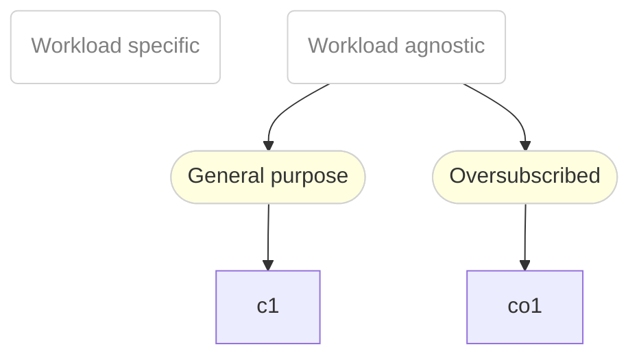

# Introduction

This is the documentation for the instance types defined in [instanceTypes.yaml](instanceTypes.yaml).

> **Note**
> The follow instance types are provided by OpenShift by default.
> They can be easily build and installed from source with:
>
> ```bash session
> $ kubectl kustomize > instanceTypes.yaml
> $ kubectl apply -f instanceTypes.yaml
> ```

# Overview

## Structure

The available instance types are structured into two themes:

1. Workload agnostic - or general purpose
2. Workload specific

Instance Types of the first theme are a good starting point to run your workload.
Once you know more about the requirements of your workload, you can start choosing a
specific instance type of the second class.

The following diagram summarises the available instance types and their use-cases:



### Schema

<details><summary>Click in order to view the instanceType names schema</summary>

```ebnf
instanceTypeName = seriesName , "." , size;

seriesName = ( class | vendorClass ) , version;

class = "n" | "no" | "cx" | "m";
vendorClass = "g" , vendorHint;
vendorHint = "n" | "i" | "a";
version = "1";

size = "small" | "medium" | "large" | [( "2" | "4" | "8" )] , "xlarge";
```
</details>


# Series

.                           |  C    |  CO
----------------------------|-------|------
*Cache backed RAM*          |       |  ✓
*Burstable CPU performance* |  ✓    |  ✓
*vCPU-To-Memory Ratio*      |  1:4  |  1:4

## C Series

The C Series is quite neutral and provides resources for
general purpose applications.

*C* is the abbreviation for "Compute", hinting at the fact that
this family is providing general compute resources to
workloads.

VMs of instance types will share physical CPU cores on a
time-slice basis with other VMs.

### C Series Characteristics

Specific characteristics of this series are:
- *Burstable CPU performance* - The workload has a baseline compute
  performance but is permitted to burst beyond this baseline, if
  excess compute is available
- *vCPU-To-Memory Ratio (1:4)* - A vCPU-to-Memory ratio of 1:4, for less
  noise per node

### C Series Instance Types

The following instance types are available in this series:

Name       | Cores | Memory
-----------|-------|-------
c1.medium  | 1     | 4Gi
c1.large   | 2     | 8Gi
c1.2xlarge | 8     | 32Gi
c1.4xlarge | 16    | 64Gi
c1.8xlarge | 32    | 128Gi


## CO Series

The CO Series is based on the C Series, with the difference
of being memory oversubscribed.

*CO* is the abbreviation for "Compute and Oversubscribed"
hinting at the neutral attitude towards workloads and the fact
that instances of this type are memory oversubscribed.

VMs of instance types will share physical CPU cores on a
time-slice basis with other VMs.

### CO Series Characteristics

Specific characteristics of this series are:
- *Burstable CPU performance* - The workload has a baseline compute
  performance but is permitted to burst beyond this baseline, if
  excess compute is available
- *Cache backed RAM* - VM RAM is cached based in order to provide memory
  overcommit
- *vCPU-To-Memory Ratio (1:4)* - A vCPU-to-Memory ratio of 1:4, for less
  noise per node

### CO Series Instance Types

The following instance types are available in this series:

Name        | Cores | Memory
------------|-------|-------
co1.medium  | 1     | 4Gi
co1.large   | 2     | 8Gi
co1.2xlarge | 8     | 32Gi
co1.4xlarge | 16    | 64Gi
co1.8xlarge | 32    | 128Gi


