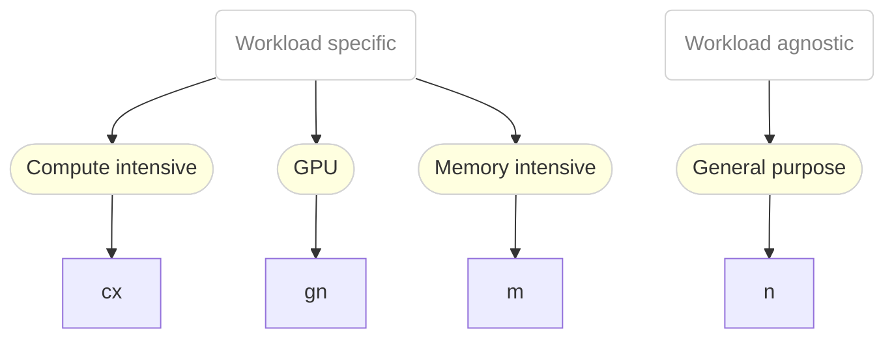

# Overview

The available instance types are structured into two themes:

1. General purpose
2. Workload specific

Instance Types of the first theme are a good starting point to run your workload.
Once you know more about the requirements of your workload, you can start choosing a
specific instance type of the second class.

The following diagram summarises the available instance types and the use-cases:

# CX Series
The CX Series provides exclusive compute resources for compute
intensive applications. The exclusive resources are given to the
compute threads of the VM. In order to ensure this, some additional
cores (depending on the number of disks and NICs) will be requested to
offload the IO threading from cores dedicated to the workload. In
addition, in this series, the NUMA topology of the used cores is
provided to the VM.

The following instance types are available in this series:

Name        | Cores | Memory
------------|-------|-------
cx1.medium  | 1     | 2Gi   
cx1.large   | 2     | 4Gi   
cx1.xlarge  | 4     | 8Gi   
cx1.2xlarge | 8     | 16Gi  
cx1.4xlarge | 16    | 32Gi  
cx1.8xlarge | 32    | 64Gi  

# GN Series
The GN Series provides instances types intended for VMs with NVIDIA
GPU resources attached.

The following instance types are available in this series:

Name        | Cores | Memory
------------|-------|-------
gn1.xlarge  | 4     | 16Gi  
gn1.2xlarge | 8     | 32Gi  
gn1.4xlarge | 16    | 64Gi  
gn1.8xlarge | 32    | 128Gi 

# M Series
The M Series provides resources for memory intensive applications.

The following instance types are available in this series:

Name       | Cores | Memory
-----------|-------|-------
m1.large   | 2     | 16Gi  
m1.xlarge  | 4     | 32Gi  
m1.2xlarge | 8     | 64Gi  
m1.4xlarge | 16    | 128Gi 
m1.8xlarge | 32    | 256Gi 

# N Series
The N Series is quite neutral and provides resources for general
purpose applications. VMs of instance types will share physical CPU
cores on a time-slice basis with other VMs.

The following instance types are available in this series:

Name       | Cores | Memory
-----------|-------|-------
n1.medium  | 1     | 4Gi   
n1.large   | 2     | 8Gi   
n1.xlarge  | 4     | 16Gi  
n1.2xlarge | 8     | 32Gi  
n1.4xlarge | 16    | 64Gi  
n1.8xlarge | 32    | 128Gi 

