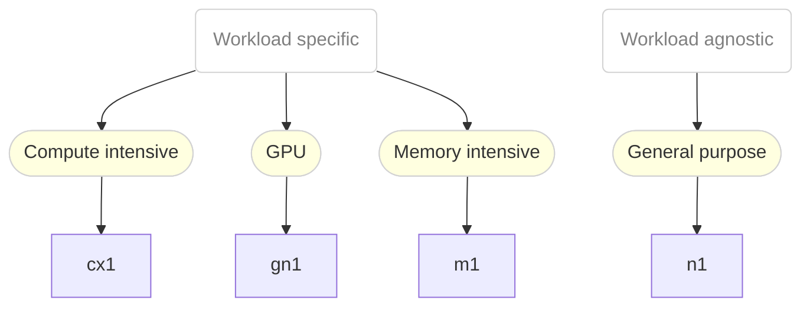

# Introduction

This is the documentation for the instance types defined in [instanceTypes.yaml](instanceTypes.yaml).

> **Note**
> These instance types are provided by OpenShift by default, if not, then they can be easily build and 
> installed by running:
>
> ```
> $ kubectl kustomize > instanceTypes.yaml
> $ kubectl apply -f instanceTypes.yaml
> ``

# Overview

The available instance types are structured into two themes:

1. General purpose
2. Workload specific

Instance Types of the first theme are a good starting point to run your workload.
Once you know more about the requirements of your workload, you can start choosing a
specific instance type of the second class.

The following diagram summarises the available instance types and their use-cases:



## Schema

The schema of the instance types can be defined with

```ebnf
instanceTypeName = seriesName , "." , size;

seriesName = ( class | vendorClass ) , version;

class = "n" | "cx" | "m";
vendorClass = "g" , vendorHint;
vendorHint = "n" | "i" | "a";
version = "1";

size = "small" | "medium" | "large" | [( "2" | "4" | "8" )] , "xlarge";
```

# Series
## CX Series

The CX Series provides exclusive compute resources for compute
intensive applications.

*CX* is the abbreviation of "Compute Exclusive".

The exclusive resources are given to the compute threads of the
VM. In order to ensure this, some additional cores (depending
on the number of disks and NICs) will be requestedto offload
the IO threading from cores dedicated to the workload.
In addition, in this series, the NUMA topology of the used
cores is provided to the VM.

### Characteristics

Specific characteristics of this series are:
- Dedicated physical cores are exclusively assigned to every vCPU in
  order to provide high compute guarantees to the workload
- Hypervisor emulator threads are isolated from the vCPUs in order to
  reduce emaulation related impact on the workload
- IO threads are isolated from the vCPUs in order to reduce IO related
  impact on the workload
- Multiqueueing is used for disks in order to increase storage
  performance
- Multiqueueing is used for vNICs in order to increase network
  performance
- Physical NUMA topology is reflected in the guest in order to optimize
  guest sided cache utilization

### Instance Types

The following instance types are available in this series:

Name        | Cores | Memory
------------|-------|-------
cx1.medium  | 1     | 2Gi   
cx1.large   | 2     | 4Gi   
cx1.xlarge  | 4     | 8Gi   
cx1.2xlarge | 8     | 16Gi  
cx1.4xlarge | 16    | 32Gi  
cx1.8xlarge | 32    | 64Gi  


## GN Series

The GN Series provides instances types intended for VMs with
NVIDIA GPU resources attached.

*GN* is the abbreviation of "GPU NVIDIA".

This series is intended to be used with VMs consuming GPUs
provided by the [NVIDIA GPU Operator](https://github.com/NVIDIA/gpu-operator)
which is made available on OpenShift via OperatorHub.

### Characteristics

Specific characteristics of this series are:
- Has GPUs predefined

### Instance Types

The following instance types are available in this series:

Name        | Cores | Memory
------------|-------|-------
gn1.xlarge  | 4     | 16Gi  
gn1.2xlarge | 8     | 32Gi  
gn1.4xlarge | 16    | 64Gi  
gn1.8xlarge | 32    | 128Gi 


## M Series

The M Series provides resources for memory intensive applications.
*M* is the abbreviation of "Memory".

### Characteristics

Specific characteristics of this series are:
- Hugepages are used in order to improve memory performance

### Instance Types

The following instance types are available in this series:

Name       | Cores | Memory
-----------|-------|-------
m1.large   | 2     | 16Gi  
m1.xlarge  | 4     | 32Gi  
m1.2xlarge | 8     | 64Gi  
m1.4xlarge | 16    | 128Gi 
m1.8xlarge | 32    | 256Gi 


## N Series

The N Series is quite neutral and provides resources for general purpose applications.
*N* is the abbreviation for "Neutral", hinting at the neutral attitude towards workloads.
VMs of instance types will share physical CPU cores on a time-slice basis with other VMs.

### Characteristics

This series has no specific characteristics.

### Instance Types

The following instance types are available in this series:

Name       | Cores | Memory
-----------|-------|-------
n1.medium  | 1     | 4Gi   
n1.large   | 2     | 8Gi   
n1.xlarge  | 4     | 16Gi  
n1.2xlarge | 8     | 32Gi  
n1.4xlarge | 16    | 64Gi  
n1.8xlarge | 32    | 128Gi 


